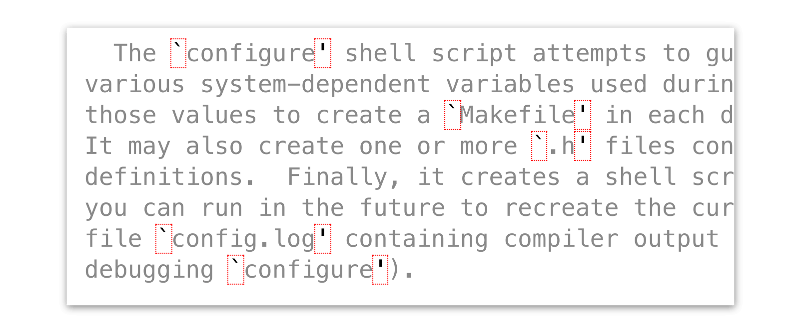
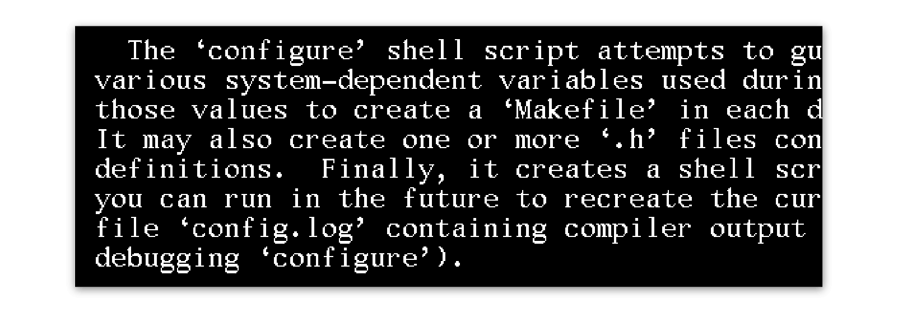
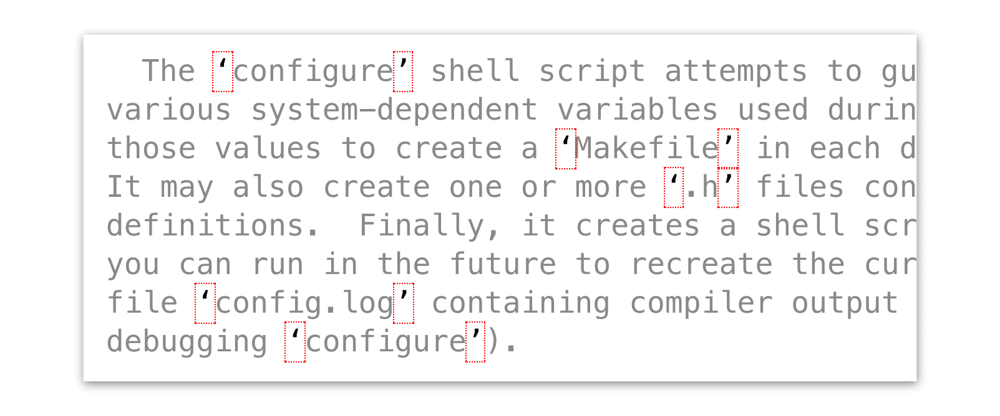

XTerm-style quote hack
======================

You've probably seen text quoted &#96;like this' before:

Unless you were hacking in the 80s, chances are this notation looks foreign and hackish to you. The origin of this quote-style is [kinda complicated](https://unix.stackexchange.com/a/73996/101379), but basically pre-Unicode terminals had screen fonts with backtick/apostrophe glyphs that looked like this:

Whoa! Much nicer, eh? Sad you don't see it once you fire up your window manager...

Unless you install this.
------------------------
This package employs a sly hack to style &#96;this' to look like ‘this’ (using [`U+2018`](https://graphemica.com/%E2%80%98)/[`U+2019`](https://graphemica.com/%E2%80%99), proper directional quotes). The effect is purely cosmetic; i.e., the underlying file data isn't changed, only its appearance:

The package is careful not to target source code, and it only applies the effect within comments, readmes, and docstrings (and only if the backtick/apostrophe style is used).

Temporarily disabling the quote-hack
------------------------------------
Understandably, it might get confusing not knowing which is a directional quote and what's secretly a backtick/apostrophe pair. The package includes an editor command to toggle the effect on-and-off, although it isn't bound to a keybinding by default. You can add one yourself, if toggling faux-quotes is important to you:

~~~cson
# In `~/.atom/keymap.cson':
body:
	"ctrl-y": "xterm-quotes:toggle"
~~~
